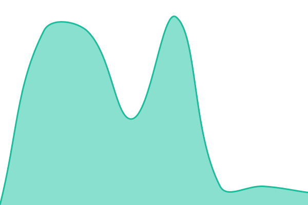

# [📈 Live Status](https://status.dittrich.pro): <!--live status--> **🟩 All systems operational**

This repository contains the open-source uptime monitor and status page for [Johannes](dittrich.pro), powered by [Upptime](https://github.com/upptime/upptime).

With [Upptime](https://upptime.js.org), you can get your own unlimited and free uptime monitor and status page, powered entirely by a GitHub repository. We use [Issues](https://github.com/Jojodicus/upptime/issues) as incident reports, [Actions](https://github.com/Jojodicus/upptime/actions) as uptime monitors, and [Pages](https://status.dittrich.pro) for the status page.

<!--start: status pages-->
<!-- This summary is generated by Upptime (https://github.com/upptime/upptime) -->
<!-- Do not edit this manually, your changes will be overwritten -->
<!-- prettier-ignore -->
| URL | Status | History | Response Time | Uptime |
| --- | ------ | ------- | ------------- | ------ |
|  [Blog](https://dittrich.pro) | 🟩 Up | [blog.yml](https://github.com/Jojodicus/upptime/commits/HEAD/history/blog.yml) | 

 678ms
     
 | 

<a href="https://status.dittrich.pro/history/blog">100.00%</a>
    

|  [Link Shorter](https://jtd.tf) | 🟩 Up | [link-shorter.yml](https://github.com/Jojodicus/upptime/commits/HEAD/history/link-shorter.yml) | 

 1069ms
     
 | 

<a href="https://status.dittrich.pro/history/link-shorter">100.00%</a>
    

|  [Cloud](https://cloud.dittrich.pro) | 🟩 Up | [cloud.yml](https://github.com/Jojodicus/upptime/commits/HEAD/history/cloud.yml) | 

 1015ms
     
 | 

<a href="https://status.dittrich.pro/history/cloud">100.00%</a>
    

|  [Stirling-PDF](https://pdf.dittrich.pro) | 🟩 Up | [stirling-pdf.yml](https://github.com/Jojodicus/upptime/commits/HEAD/history/stirling-pdf.yml) | 

 369ms
     
 | 

<a href="https://status.dittrich.pro/history/stirling-pdf">100.00%</a>
    

<!--end: status pages-->

[**Visit our status website →**](https://status.dittrich.pro)

## 📄 License

- Powered by: [Upptime](https://github.com/upptime/upptime)
- Code: [MIT](./LICENSE) © [Anand Chowdhary](https://anandchowdhary.com), supported by [Pabio](https://pabio.com)
- Data in the `./history` directory: [Open Database License](https://opendatacommons.org/licenses/odbl/1-0/)
